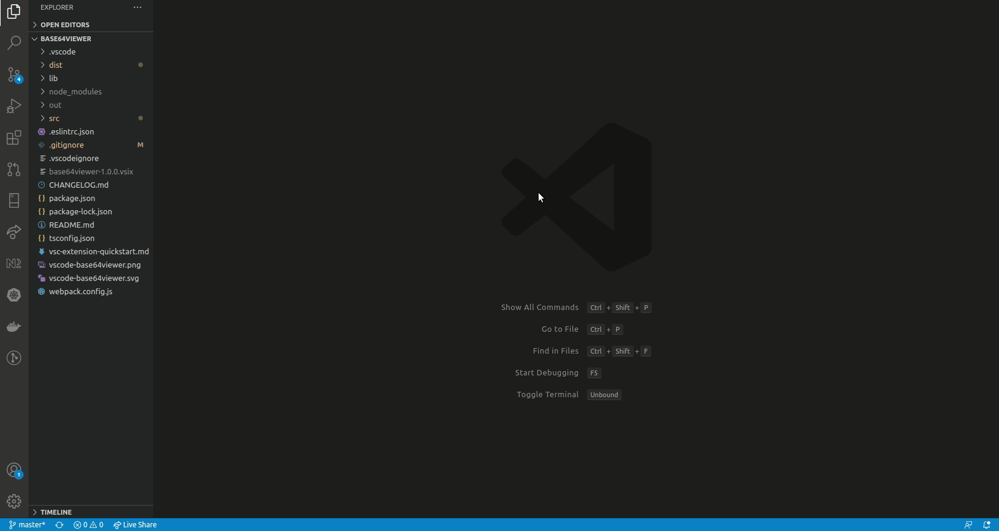

# Base64Viewer

Decode Base64 strings and show the file, and encode files to base 64 strings.

## Features

### Base64 Decoding

You can decode base64 string corresponding to plain text, pdf, and images (PNG, JPG, GIF, BMP). Other formats might be added in the future.
When the base64 string corresponds to a pdf file, a second column, next to the pdf viewer, is added, showing all text elements found in the pdf file.

### Base64 Encoding

You can encode any file to a base64 string.
When encoding a pdf file, you can switch the view between the base 64 string and a list of text elements found in the file.

## Extension Settings

* `base64viewer.decodeBase64`: Show an input where you can paste the base64 string to decode
* `base64viewer.encodeBase64`: Open a file selection dialog where you can choose a file to encode

## Demos

### Decoding

### Encoding

## Known Issues

No known issue

## Release Notes

### 1.0.0

Initial release of the extension.
